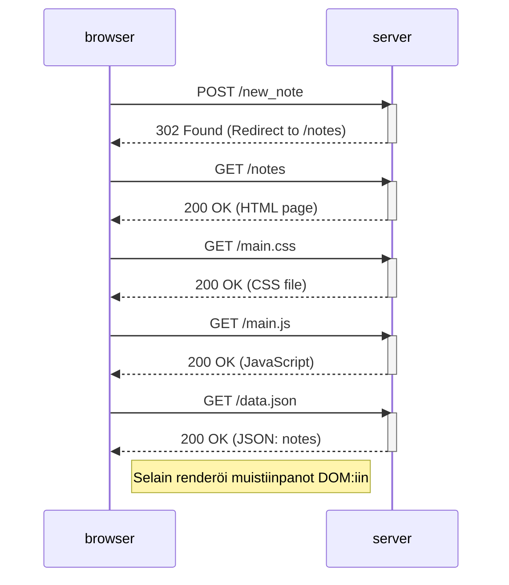

```mermaid
sequenceDiagram
    participant browser
    participant server

    browser->>server: POST /new_note
    activate server
    server-->>browser: 302 Found (Redirect to /notes)
    deactivate server

    browser->>server: GET /notes
    activate server
    server-->>browser: 200 OK (HTML page)
    deactivate server

    browser->>server: GET /main.css
    activate server
    server-->>browser: 200 OK (CSS file)
    deactivate server

    browser->>server: GET /main.js
    activate server
    server-->>browser: 200 OK (JavaScript)
    deactivate server

    browser->>server: GET /data.json
    activate server
    server-->>browser: 200 OK (JSON: notes)
    deactivate server

    Note right of browser: Selain renderöi muistiinpanot DOM:iin
```