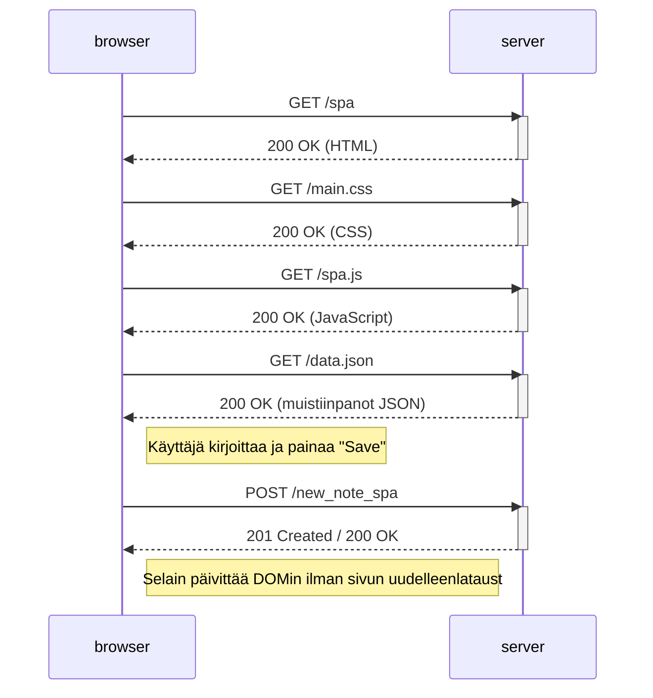

```mermaid
sequenceDiagram
    participant browser
    participant server

    browser->>server: GET /spa
    activate server
    server-->>browser: 200 OK (HTML)
    deactivate server

    browser->>server: GET /main.css
    activate server
    server-->>browser: 200 OK (CSS)
    deactivate server

    browser->>server: GET /spa.js
    activate server
    server-->>browser: 200 OK (JavaScript)
    deactivate server

    browser->>server: GET /data.json
    activate server
    server-->>browser: 200 OK (muistiinpanot JSON)
    deactivate server

    Note right of browser: Käyttäjä kirjoittaa ja painaa "Save"

    browser->>server: POST /new_note_spa
    activate server
    server-->>browser: 201 Created / 200 OK
    deactivate server

    Note right of browser: Selain päivittää DOMin ilman sivun uudelleenlataust
```